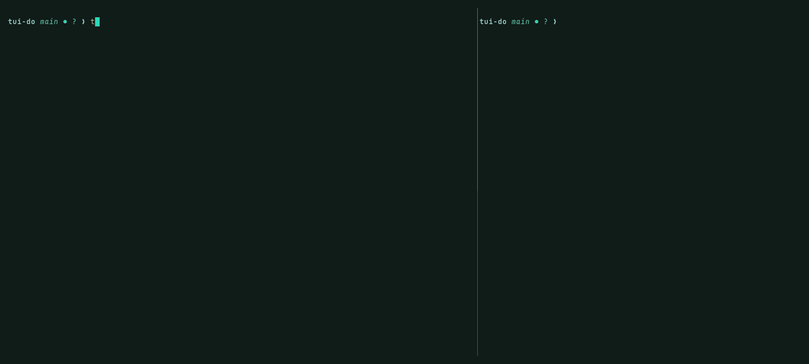

# tui-do

[](https://github.com/sponsors/sjwasko)
[](https://buymeacoffee.com/sutibu)

A fast, local-first terminal client for [Vikunja](https://vikunja.io).

tui-do keeps your tasks in a local SQLite store and reconciles with the server in the
background. It starts instantly, works with the server unreachable, and never blocks a frame
on a network call. Built to be the foundation for tracking not only your tasks, but also
agentic tasks and workflows.

Feel the flow break when you have to tab out of tmux or herdr or your terminal sessions to go
to a PWA or the web page for your Vikunja instance? I'm with you, tui-do is the answer!

> **Status: 1.0.** `v1.0.0` is published and is what the commands below install. Everything
> documented here works and is used daily against a real Vikunja;
> [what's planned](#whats-planned--coming) is set out rather than left to be discovered.



*The right-hand pane is a scripted stand-in for an agent, not a live model, but the
`tui-do add` it runs is real, and the task it files is the one the interface pulls in.
Regenerate it with [`docs/demo/tui-do-agent.tape`](docs/demo/tui-do-agent.tape).*

> [!WARNING]
> **Back up your Vikunja data before you use this.** tui-do writes to your real server: it
> creates, edits, completes and **deletes** tasks, and every sync reconciles your local copy
> against what the server holds.
>
> Undo (`u`) covers most of what you do from the interface, and is worth knowing the limits
> of. **Undoing a delete re-creates the task with a new id, so its comments and attachments
> do not come back**, because Vikunja has no undelete. Creating a label cannot be undone at
> all. And on a genuine conflict, where you and another client have changed the same field,
> your value wins and overwrites theirs by design.
>
> Take an export first (Vikunja can export your account's data from your user settings) and
> keep it until you trust this. **The software comes with no warranty of any kind, and the
> authors accept no liability for lost or damaged data.** The formal terms are in
> [License](#license); this paragraph is the plain-English version.
>
> The local store (`~/.local/share/tui-do/tui-do.db` on Linux; see
> [Where tui-do keeps its files](#where-tui-do-keeps-its-files) for macOS) is disposable:
> delete it and the next
> run re-syncs. What is worth protecting is what lives on your Vikunja server.
> Open issues are listed in [`bugs.md`](bugs.md).

## What it does

- **Reads instantly and works offline.** Every read is answered by the local store, so the
  interface does not wait on the network, and neither startup nor editing needs the server
  to be reachable. Queue up your todos while on the plane or train with no wifi.
- **Writes optimistically.** A change lands locally and is queued; the sync engine sends it
  when it can. A rejection rolls the change back and says so. A failure blocks that one
  task, not the queue.
- **Quick-add syntax** for creating tasks in one line, from the interface or the shell.
- **Task descriptions rendered**: Markdown, plain text, or the HTML Vikunja's web editor
  stores, in your own colours, in process, with no external tools.
- **Labels, priorities, due dates, projects**, with fuzzy pickers for each. Labels can be
  created, renamed and recoloured from inside tui-do.
- **Undo and redo**, riding on the same optimistic-write mechanism rather than a parallel
  one.
- **Configurable column layouts** and quick actions.

## Install

One binary, needing no Rust, no C toolchain and no system SQLite.
[Building from source](#building-from-source) is only needed to modify tui-do.

**On Linux it is statically linked** — nothing but a kernel is required, and the same file
runs on Arch, Ubuntu, Debian, Fedora and older LTS releases alike. **On macOS it is not, and
cannot be**: Apple ships no static libSystem, so the Mac binary links the system libraries
every Mac already has. The release refuses to publish one that reaches outside `/usr/lib`
and `/System/Library`, which is the same guarantee arrived at differently.

**Tested on:** Ubuntu 24.04, Ubuntu 26.04, Omarchy 4.0.1-1j, Raspberry Pi OS (64-bit,
Raspberry Pi 5), Ubuntu 24.04 (Raspberry Pi 4 Model B). Your results may vary on other
releases and distributions.

```sh
tag=v1.0.2
arch=$(uname -m)          # x86_64 or aarch64
base=https://github.com/sjwasko/tui-do/releases/download/$tag

curl -fLO "$base/tui-do-$tag-$arch-unknown-linux-musl.tar.gz"
curl -fLO "$base/SHA256SUMS"
sha256sum --check --ignore-missing SHA256SUMS

tar -xzf "tui-do-$tag-$arch-unknown-linux-musl.tar.gz"
install -Dm755 "tui-do-$tag-$arch-unknown-linux-musl/tui-do" ~/.local/bin/tui-do
```

The `sha256sum --check` line is worth keeping: it catches a truncated download, which
otherwise shows up as a confusing crash rather than as the incomplete file it is. The only
external program tui-do ever calls is the one that opens a link when you press `o`:
`xdg-open` on Linux, `open` on macOS.

### macOS

```sh
brew install sjwasko/tui-do/tui-do
```

The release also carries `tui-do-<tag>-aarch64-apple-darwin.tar.gz` if you would rather not
use Homebrew. Two things differ from the Linux recipe above and both fail confusingly:
macOS has no `sha256sum` (`shasum -a 256 --check --ignore-missing` instead), and BSD
`install` has no `-D` (`mkdir -p ~/.local/bin` first).

**Apple Silicon only.** There is no Intel build; on an Intel Mac,
[build from source](#building-from-source).

### Putting `~/.local/bin` on your `PATH`

Many distributions add it already when the directory exists, so check before changing
anything:

```sh
command -v tui-do
```

A path means you are done. Nothing means your shell cannot find it yet, so add it and then
open a new terminal:

```sh
# bash
echo 'export PATH="$HOME/.local/bin:$PATH"' >> ~/.bashrc

# zsh
echo 'export PATH="$HOME/.local/bin:$PATH"' >> ~/.zshrc

# fish -- persistent, and takes effect immediately
fish_add_path ~/.local/bin
```

`fish_add_path` needs fish 3.2 or newer, and is preferred over a `set -x PATH` line in
`config.fish` because it records the directory once, so re-running it does not stack
duplicates. On older fish, add `set -gx PATH $HOME/.local/bin $PATH` to `config.fish`
instead.

If you use bash and it still is not found in a *login* shell (over SSH, say), your system
reads `~/.profile` rather than `~/.bashrc` for those; add the same `export` line there too.

## REQUIRED - First time setup

**There is no first-run wizard, and no config is written for you.** Without one tui-do stops
with `could not read …/config.yaml: No such file or directory`. If you'd like to see one
added, open up an issue.

Create an API token in Vikunja under **Settings → API tokens**. Vikunja tokens are scoped,
and the scopes are not obvious, so see [Token permissions](#token-permissions) below if you
get *"not authorized: missing, malformed, expired or otherwise invalid token provided"*.

Then, on **Linux**:

```sh
mkdir -p ~/.config/tui-do
printf '%s' 'YOUR_TOKEN_HERE' > ~/.config/tui-do/token
chmod 600 ~/.config/tui-do/token
$EDITOR ~/.config/tui-do/config.yaml
```

Or on **macOS**, where all three files share one directory. Note the space in the path,
which is why every line here is quoted:

```sh
dir="$HOME/Library/Application Support/tui-do"
mkdir -p "$dir"
printf '%s' 'YOUR_TOKEN_HERE' > "$dir/token"
chmod 600 "$dir/token"
$EDITOR "$dir/config.yaml"
```

A URL and somewhere to find the token is the whole minimum, and this file is the same on
both platforms:

```yaml
server:
  url: https://vikunja.example.com
  token_file: token
```

`token_file: token` is **relative**, so it resolves against the directory holding the config
that names it. Writing it that way is what makes the config portable: it works unchanged on
either platform, and it travels to a new machine alongside its token with no absolute path
to keep in step. An absolute path or one starting `~` works too if you would rather be
explicit.

Then run `tui-do`. Everything else has a default; see the
[configuration reference](#configuration-reference) for the rest.

Only the first line of the token file is used, and it is trimmed, so a trailing newline is
harmless. `TUI_DO_API_TOKEN` works instead of the file if you would rather not have one, and
`TUI_DO_CONFIG` overrides where the config is read from. tui-do warns if either file is
readable by other accounts.

### Where tui-do keeps its files

tui-do follows each platform's own convention rather than imposing one, so the paths differ.
Deleting the database is safe on either: the next run re-syncs.

| | Linux | macOS |
|---|---|---|
| config | `~/.config/tui-do/config.yaml` | `~/Library/Application Support/tui-do/config.yaml` |
| token | `~/.config/tui-do/token` | `~/Library/Application Support/tui-do/token` |
| store | `~/.local/share/tui-do/tui-do.db` | `~/Library/Application Support/tui-do/tui-do.db` |

**On macOS all three share one directory**, where Linux splits config from data. That is what
Apple's layout gives, and it is worth knowing before you go looking for a second folder that
does not exist.

`XDG_CONFIG_HOME` and `XDG_DATA_HOME` are honoured on Linux and deliberately ignored on
macOS, which is the platform convention. If you want one path shape across machines of both
kinds, set `TUI_DO_CONFIG` and `TUI_DO_DB` rather than the XDG variables; `--config` beats
both.

A `token_file` may be relative, in which case it resolves against the directory holding the
config that names it. That is the portable way to write it: the config and its token then
travel together to any machine, on either platform, with no absolute path to keep in step.

## Configuration reference

tui-do reads the config from the platform path above, or from `$XDG_CONFIG_HOME/tui-do/`
on Linux. `TUI_DO_CONFIG` overrides it on both. Only `server.url` and a credential are required; every
other key below shows its default.

```yaml
server:
  url: https://vikunja.example.com
  # Either point at a file holding the token, or set TUI_DO_API_TOKEN.
  # tui-do warns if the file is readable by other accounts.
  # A relative path resolves against this config's own directory, which is the
  # portable way to write it. Absolute paths and a leading ~ also work.
  token_file: token

sync:
  # The local store answers every read, so this sets staleness rather than speed.
  # Shorter if you have several instances syncing against the same Vikunja.
  interval_seconds: 300
  enabled: true

view:
  default_filter: done = false
  active_layout: default

# Reached with Space, then the key.
quick_actions:
- key: 'u'
  action: priority
  target: 5
- key: 'w'
  action: project
  target: Work
```

### Token permissions

Vikunja's API tokens carry a per-route permission list, and a token that looks complete can
still fail. Grant these groups:

| group | why |
|---|---|
| `other` → **`user`** | Identifies who you are at startup. **Without it tui-do does not start.** |
| `tasks` | Read, create, edit, complete and delete tasks |
| `tasks_labels` | Attach and detach labels, a *separate* group from `labels` |
| `labels` | Create, rename and recolour labels |
| `projects` | List projects, and move tasks between them |
| `projects_views` | Read a project's views, which is how the list view is resolved |
| `tasks_assignees` | Only if you assign people |

Two of these are easy to miss and both fail unhelpfully.

**`other` → `user` is the one that stops tui-do dead.** Every task and project call can
succeed while `GET /user` returns 401, and what you see is a red toast reading *"not
authorized: missing, malformed, expired or otherwise invalid token provided"*, which reads
like the token is wrong when in fact it is merely incomplete.

**`tasks_labels` is not part of `labels`.** With `labels` alone you can create and rename
labels but not put one on a task, so `l` fails with the same message while everything else
works.

## Keys

`?` shows this table inside the application, and `:` runs any command by name if you would
rather not remember a key.

### Navigation

| | |
|---|---|
| `j` / `k`, `↓` / `↑` | Move down / up |
| `C-d` / `C-u`, `PgDn` / `PgUp` | Page down / up |
| `g g` / `G`, `Home` / `End` | Jump to top / bottom |
| `Tab` / `S-Tab` | Focus the next / previous pane |
| `g p` / `g l` | Go to a project / label |
| `/` | Search the current list |
| `Enter` | Open the selected task |
| `Esc` | Back to the list, then out of a search |

### Tasks

| | |
|---|---|
| `a` | Add a task, in quick-add syntax |
| `e` | Edit the selected task |
| `d` | Mark done, or not done |
| `p` / `D` | Set priority / due date |
| `l` | Add or remove labels |
| `m` | Move to another project |
| `o` | Open a link in the selected task |
| `x` | Delete the task |
| `u` / `C-r` | Undo / redo |
| `Space` | Configured quick actions |

### View and application

| | |
|---|---|
| `z s` / `z p` | Show or hide the sidebar / preview pane |
| `t` | Show or hide completed tasks |
| `L` / `H` | Next / previous column layout |
| `r` | Sync: push, then fetch what changed |
| `R` | Sync everything, so deletions made elsewhere are noticed |
| `:` / `?` | Run a command by name / show the keys |
| `q`, `C-c` | Quit |

**`o` copies rather than opens when there is nothing to open onto.** Over SSH the opener
would launch a browser on the machine at the far end of the connection instead of the one you
are sitting at. So with `SSH_CONNECTION` set, or -- on Linux -- with neither `DISPLAY` nor
`WAYLAND_DISPLAY`, `o` puts the URL on your clipboard over OSC 52, which lands in the
terminal *you* are typing in. That is working as intended, not a missing opener. The toast
names what it copied, because a few terminals ship with OSC 52 disabled and tui-do has no way
to tell.

The opener is `xdg-open` on Linux and `open` on macOS. A local macOS session always has a
window server to open onto and sets neither `DISPLAY` nor `WAYLAND_DISPLAY`, so only the SSH
rule applies there -- over SSH into a Mac, `o` still copies.

## Quick-add syntax

Tokens may appear anywhere in the line and are taken out of the title.

| | |
|---|---|
| `+project` | File it in a project, by title or id: `+Legal`, `+#12` |
| `*label` | Attach a label: `*urgent` |
| `@user` | Assign someone: `@admin` |
| `!1` … `!5` | Priority, 1 lowest to 5 highest |
| a date | `tomorrow`, `next friday`, `27/08/26`, `27aug26`, `2026-08-27` |
| `due <date>` / `start <date>` | The same, said explicitly |
| `every <n> <unit>` | Repeat: `every 2 weeks`, `every month` |

Wrap a name containing spaces in brackets or quotes; brackets are usually easier from a
shell, which strips quotes before tui-do sees them:

```sh
tui-do add 'Renew the domain *urgent !3 +Admin tomorrow'
tui-do add 'File the quarterly return +[Life Admin] 27aug26'
tui-do add 'Water the plants every 3 days'
```

**Use single quotes, not double.** At an interactive `bash` prompt, `!3` is history
expansion: the shell replaces it with an earlier command *before* tui-do sees the line,
inside double quotes as readily as outside them. The task is then created with no priority
and a stray word in its title, and nothing reports an error, because as far as tui-do is
concerned that is what you typed. Measured: `tui-do add "… !3 tomorrow"` at a bash prompt
became `… exit tomorrow`. `zsh` expands `!` history references by default too. Single quotes
suppress it, `fish` does not do this at all, and a non-interactive shell (a script, or an
agent) has history expansion off regardless.

## From the shell

`tui-do add` applies locally and queues for the server exactly as the interface does, so it
works on a plane. Two flags matter:

- **`--create-labels`** creates any label the line names that does not exist yet. The
  interface asks instead of assuming.
- **`--offline`** skips the send entirely, **but it needs a store that already knows your
  projects**, because a task has to be filed somewhere. On a machine that has never synced
  you get *"no project to add to"*. Without the flag `tui-do add` fetches the project list
  before it gives up, so run it once without `--offline` on a new machine (or start
  `tui-do`, which syncs at launch). After that it works on a plane as advertised.

Shell completions, including for the quick-add flags:

```sh
tui-do completions fish > ~/.config/fish/completions/tui-do.fish
tui-do completions zsh  > ~/.zfunc/_tui-do          # with ~/.zfunc on $fpath
tui-do completions bash > ~/.local/share/bash-completion/completions/tui-do
```

## For agents

`tui-do add` is a good target for automation. One line resolves a label, a priority, a
project and a due date:

```sh
tui-do add 'Chase the upstream ticket *urgent !4 +Infra tomorrow'
```

Constructing the equivalent Vikunja request means knowing a project id, a label id, and that
"unset" on the wire is Go's zero time rather than `null`.

It is also the right surface rather than merely a convenient one. The write lands in the
local store first, so the command returns whether or not the server is reachable, and an
unreachable server queues the task instead of losing it. It takes **the same path the
interface does**: the same outbox, the same backoff, and the same three-way merge that
replays your change onto the server's current copy. Something calling the Vikunja API
directly is a second writer with none of that.

**`skills/tui-do/SKILL.md`** documents this for agents and is installable as a skill by tools
that support them. It is plain Markdown, so anything else can simply read it.

One flag deserves mentioning: **`--create-labels` should usually stay off.**
Labels are one global pool shared by every project, so a typo in a generated line becomes a
permanent entry that pollutes completion everywhere. Pass it only where the label vocabulary
is yours rather than a model's.

### What verbs/actions to add for agents next?

**Today `add` is the whole agent surface.** Reading, completing and moving tasks from the
command line are planned and not in this release, and which verbs get built is a democratic
process. If you are driving tui-do from an agent,
[open an issue](https://github.com/sjwasko/tui-do/issues) and say what you were trying to
automate. That is worth more to me than a feature request in the abstract. Let's make this
agentic together!

**Kanban is the open design question.** The list view is the only view today, and boards are
planned. What an agent should *say* to move a task across a board — name a bucket, set a
status, ask for "the next column" — is genuinely undecided, and it is the kind of thing that
is easy to get wrong in a way you only notice after people depend on it. If you work in
Vikunja's board views, I would like your opinion before it is built rather than after.

My vision on Kanban: scope an agent using a project or a label, dump a series of tasks into
that project, arrange them in order, then have your agent start with that label or project
and move tasks as they complete through the board. The project or label can become a very
quick visual board for long-running, multi-step agentic tasks, instead of parsing through log
files that differ by agent type in multiple terminal windows. How would you envision this
being used?

**Contributors and testers are welcome and needed.** This project is small enough to be a
reasonable first contribution and is not yet load-bearing for anyone, which makes it the
perfect time in the project to try something and shape its future. Testing counts as much as
code: running it against your own Vikunja, on your own hardware, and reporting what works,
what doesn't, and what you need to be productive. Open an issue, not a PR (as mentioned).

## What's Planned & Coming

1.0 is deliberately small: the foundation is the part I tried to get right. What follows is
where tui-do goes next, and the *order is not settled*, which is exactly where I can use your
help!

**Coming**

- **A macOS port.** The hard part is already done: rendering needs no platform knowledge at
  all, and the one thing that genuinely does, opening a URL, is already behind a seam built
  for this. It may well build today, but it is not tested or supported yet; that should be a
  quick gap to close.
- **A real agent surface.** `add` is the only action right now. Reading, completing, moving
  and searching from the command line turn tui-do into something an agent can actually
  operate rather than only write to. See [For agents](#for-agents); this is the one I most
  want to talk to people about.
- **Disconnected mode.** tui-do with no Vikunja behind it at all: a fast local task list that
  happens to speak Vikunja when there is a server to speak to. This is closer than it sounds,
  because the local store already answers every read and the server is already optional at
  startup. What is missing is making it optional *permanently*, and deciding what sync means
  if you later decide you do want to sync to a Vikunja server. But in my humble opinion, the
  app is pretty kick ass and you shouldn't need Vikunja if you want to use it standalone for
  your workflow.
- **Kanban, table and Gantt views, and saved filters.** The list view is the only view
  currently. Boards are the most-asked-for and the least-designed; how an agent should
  express a move across one is an open question.
- **Comments.** The API client can already do it; nothing in the interface reaches it yet.
  Future effort.
- **Subtasks and task relations.** Vikunja's relation kinds are parsed and preserved on every
  write today, so the data survives; it is just not shown or editable. Future effort.
- **Windows, honestly.** The answer is WSL and will stay WSL, but "use WSL" is a claim nobody
  has verified on a schedule. Making that a tested priority rather than an assumption is
  on the long list.

**Deliberately not**

- **Attachments.** Out of scope. Existing attachments survive edits untouched; tui-do
  neither displays them nor uploads them.
- **Deleting a label.** It cannot be undone honestly, because the label would come back with
  a new id detached from every task it was on. If it is ever built it gets a confirmation and
  a plain "this cannot be undone", not a broken undo.

**Which of these first?** That is a genuine question, not a rhetorical one: the order above
is not a commitment and I would rather build what people will use than what I guessed at.
[Open an issue](https://github.com/sjwasko/tui-do/issues) and say which one matters to you
and why, or that the thing you want is not on the list at all. Volunteers to help build or
test any of it are very welcome.

## Platform support

**Linux is the only supported platform.** Developed on Omarchy (Arch), with Ubuntu as the
second supported target: built and tested against 26.04 in CI, and hand-driven on both 24.04
and 26.04 hardware, on x86-64 and aarch64 alike.

- **macOS.** Apple Silicon, tested by hand on macOS 26 across several terminals, tmux, and
  over SSH from Linux. Installed with Homebrew or from the release tarball. Intel is not
  built.
- **Windows.** Not a target. Use [WSL](https://learn.microsoft.com/windows/wsl/install) and
  run the Linux build. There are no plans to ship a native Windows binary.

## Building from source

Only needed to modify tui-do, or to run on an architecture no release covers. **SQLite is
compiled from source**, so a C toolchain is required even though the resulting binary needs
none. Rust **1.85 or newer**.

On a fresh Debian or Ubuntu:

```sh
sudo apt-get update
sudo apt-get install -y --no-install-recommends \
    curl ca-certificates build-essential pkg-config git

# Take Rust from rustup rather than the distribution, which may package
# a version older than 1.85.
curl -sSf https://sh.rustup.rs | sh -s -- -y --profile minimal --default-toolchain stable
. "$HOME/.cargo/env"
```

On Arch: `sudo pacman -S --needed rust base-devel git`.

No OpenSSL development headers are needed: TLS is rustls, and `ca-certificates` is what it
reads the system trust store from.

Then:

```sh
git clone https://github.com/sjwasko/tui-do.git
cd tui-do
cargo build --release
# `install -D` is GNU coreutils; BSD install (macOS) has no such flag.
mkdir -p ~/.local/bin
install -m755 target/release/tui-do ~/.local/bin/tui-do
```

The first build fetches and compiles the whole dependency tree and takes a few minutes.

### Running the tests

```sh
cargo test --workspace
```

**Read the total, not the last line.** `cargo test` prints one `test result:` line per test
binary (eighteen of them), and the last few are doc-test targets that legitimately contain
no tests, so the output ends with `0 passed` however well the run went. Summing them is what
tells you:

```sh
cargo test --workspace 2>&1 | grep -E '^test result' | \
  awk '{p+=$4; f+=$6} END {print "passed="p"  failed="f}'
```

Anything but `failed=0` is a real problem. `cargo clippy --workspace --all-targets` should
also be silent.

## Design

**The render loop never awaits I/O.** The UI is an Elm-style `Model` / `Msg` / `update` /
`view` loop that is pure and synchronous. Side effects are described as values and executed
by a separate async runtime that sends results back as messages.

This is enforced by the crate graph rather than by discipline:

| Crate | Responsibility | Notably cannot |
|---|---|---|
| `tui-do-api` | Typed go-vikunja REST client | — |
| `tui-do-core` | Domain model, SQLite store, sync engine, quick-add parser, config | render |
| `tui-do-ui` | `Model`, `Msg`, `update`, `view`, widgets, keymap | perform I/O: no `reqwest`, no `rusqlite`, no `tokio` |
| `tui-do` | CLI, wiring, effect runtime, terminal lifecycle | — |

Writes are optimistic: the local store updates immediately and the change is queued in an
outbox. If the server rejects it, the change is rolled back and reported. A queued update is
not sent as it was queued: the push reads the server's current copy and replays the user's
field-level change onto it, because tui-do is built to run on several machines at once.

Every endpoint the client calls is checked against `spec/vikunja.json` (the OpenAPI document
served by a live Vikunja at `/api/v1/docs.json`) by a conformance test, so an upstream API
change surfaces as a failing test rather than a runtime 404.

## Contributing

**Issues are the way in. Please do not open a pull request without asking first.**

This is not a formality, and it is not "PRs welcome" with extra steps; it is a fact about
where the repository lives. GitHub is a **read-only mirror**. Development happens on a
private Forgejo instance, and GitHub receives its commits by a push mirror, one direction
only. A pull request opened here cannot be merged where the code actually lives, so a patch
you spend an evening on would have to be re-applied by hand, and I would rather tell you
that now than after you wrote it.

So:

- **Found a bug?** [Open an issue](https://github.com/sjwasko/tui-do/issues). Include your
  distribution, your Vikunja version, and what you expected instead. If tui-do printed
  something, paste it verbatim.
- **Want a feature?** Open an issue describing the problem rather than the solution. What
  gets built first is decided by what people say they were trying to do; see
  [What's Planned & Coming](#whats-planned--coming), which is a genuine list of open
  questions, not a roadmap already settled.
- **Want to send code?** Open an issue first and say what you have in mind. If it is a fit,
  I will tell you how to get it to me. Small fixes are easy; anything touching the
  architecture is worth a conversation before you write it.

Your feedback is wanted first and foremost. See
[What verbs/actions to add for agents next?](#what-verbsactions-to-add-for-agents-next).

## Relationship to cria

tui-do began as a fork-in-spirit of [cria](https://github.com/frigidplatypus/cria) by
frigidplatypus, which established the idea of a keyboard-driven Vikunja TUI along with its
quick-add syntax and column-layout configuration. tui-do is an independent implementation
with a different architecture and does not share cria's code.

## Thank you

I wanted to take a moment to thank my wonderful wife Karrie for putting up with all the
evening and weekend vibe coding sessions. Also, this is the product of Claude Code and
multiple skills and is a first effort for me, so be kind and constructive. I very much
enjoyed the architecture and build and hope to continue building and improving for all!

## License

Licensed under either of

- Apache License, Version 2.0 ([LICENSE-APACHE](LICENSE-APACHE))
- MIT license ([LICENSE-MIT](LICENSE-MIT))

at your option.

Unless you explicitly state otherwise, any contribution intentionally submitted for inclusion
in this work by you, as defined in the Apache-2.0 license, shall be dual licensed as above,
without any additional terms or conditions.

Copyright is held collectively by the project's contributors ("The tui-do Authors");
attribution lives in the git history.
