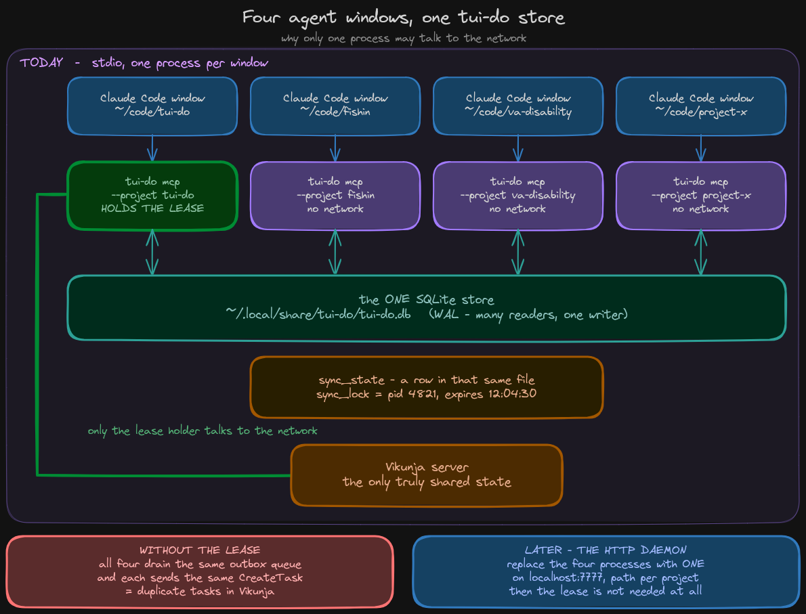

# An MCP server for tui-do

**Written 2026-09-08. Not built — status corrected 2026-09-13.**

This note said it was "being built on branch `feature/mcp-server`", and that nothing was on
`main` except the note. Both halves were wrong. The note *is* on `main`, along with every
commit that branch has: `feature/mcp-server` is an **ancestor** of `main` — no commits of its
own, six behind — and the worktree at `../tui-do-mcp` holds the same five crates `main` does.
Forgejo and GitHub both answer `418d8aa` for it, matching local, so nothing is unpushed.

Worth keeping, because it is what made the branch look alive: **a GitHub branch page renders
the whole repository at that commit**, so an empty branch is indistinguishable by eye from a
full one. The "behind / ahead" count is the only part of that page carrying the information.

---

## What this is, in one paragraph

Today an agent can only run `tui-do add`. This adds a proper agent interface: an
agent can **list tasks, read one, create one, edit one, and move it through a
workflow** — and it does all of that *through tui-do*, so it gets the local
database, the offline queue and the conflict handling for free.

MCP ("Model Context Protocol") is the standard way an agent plugs into a tool.
Claude Code, Cursor and others all speak it. You add a few lines to a config file
and the agent gains a set of "tools" it can call.

**What it looks like when it's working:**

```jsonc
// .mcp.json, in a repo you're working in
{
  "mcpServers": {
    "tui-do": {
      "command": "tui-do",
      "args": ["mcp", "--project", "tui-do"]
    }
  }
}
```

Then, in that repo, the agent can say things like *"what's left on this project?"*
or *"file a follow-up for the flaky test"* and it happens in your Vikunja — instantly,
and even with no network.

---

## 0. The process model



**Added 2026-09-13.** This diagram was drawn on 2026-09-08 and lived only as a PNG in a
home directory until it was tracked here. It is the part of the design this note did not
have: N `tui-do mcp` processes sharing one SQLite store, a `sync_lock` lease in
`sync_state` electing the one process allowed to reach the network, and the HTTP daemon
that makes the lease unnecessary later.

The reasoning it implies — what the lease is for, why identity decides whether the store
can be shared at all, and how the whole thing scales from one laptop to a team — is in
`md/TODO.md` under **"How this scales — the five tiers"**, and the assumptions it breaks in
the existing codebase are item 10 there.

---

## 1. What the agent can do

We're copying [veans](https://vikunja.io/docs/veans/)'s command set, because you
picked it as the template and it's a well-designed surface. Here it is, translated.

| Tool | What it does |
|---|---|
| `list_tasks` | List tasks. Filters by status, label, done/not-done. |
| `get_task` | Read one task. |
| `add_task` | Create a task. Takes quick-add syntax *or* plain fields. |
| `update_task` | Change title, description, priority, due date, labels. |
| `set_task_status` | Move it through the workflow (see §2). |
| `claim_task` | "I'm working on this": assigns it, sets in-progress, tags the git branch. |
| `sync` | Force a full refresh from the server. |

**Two of veans's commands we are deliberately not copying:**

- **`veans api METHOD PATH`** — a raw passthrough to the Vikunja API. Refused. Two reasons:
  it skips the offline queue (so the write can just fail and be lost), and tui-do has a test
  that checks every URL it builds exists in `spec/vikunja.json` — a passthrough builds URLs
  from whatever the agent types, so that test becomes impossible to write.
- **`veans prime`** — prints a system prompt the agent must be fed at every session start.
  MCP does this for us: the server hands the agent its instructions automatically on connect.
  Strictly better, and one less thing to remember.

**And one thing veans has that tui-do simply doesn't:** commenting. tui-do has no comment
support at all yet. It's on the backlog as owed; it isn't in this work.

---

## 2. The workflow, and the one rule

veans has a good idea and we're taking it: **an agent never marks its own work done.**
It moves work to "needs review" and parks it. A human signs it off.

Four states an agent can set:

```
todo  →  in_progress  →  in_review  →  [ a human marks it done ]
                    ↘  scrapped
```

**`done` is not on that list, and the agent literally cannot send it.** Not "we told it not
to" — the value doesn't exist in the tool definition. A rule an agent is *told* gets
forgotten when its context gets compacted. A value it can't express doesn't.

### How the states are stored

Vikunja's natural home for this is Kanban buckets. **tui-do can't read or write buckets
yet** — that's backlog item 4. So for now each state is a label:

| State | Stored as (today) | Stored as (later) |
|---|---|---|
| `todo` | label `agent:todo` | a Kanban bucket |
| `in_progress` | label `agent:in-progress` | a Kanban bucket |
| `in_review` | label `agent:in-review` | a Kanban bucket |
| `scrapped` | label `agent:scrapped` | a Kanban bucket |

**The agent never finds out which.** It always says `in_review`; only the code underneath
changes. So when buckets get built, nothing about the agent's setup or prompting changes.

This also means **the review queue (backlog item 5) stops waiting on Kanban** — it can just
filter for the `agent:in-review` label today.

> **Note on label creation.** `README.md` warns that `--create-labels` should usually stay
> off, because a typo from a model becomes a permanent global label. That warning doesn't
> apply here: these are four fixed names we chose, identical on every machine, not names a
> model invented. The server creates them if missing.

### This vocabulary is a proposal, not a decision

`README.md` currently asks the public, in the shipped release:

> What an agent should *say* to move a task across a board … **is genuinely undecided** …
> I would like your opinion before it is built rather than after.

That invitation is still open. Building this on a branch is how you get an informed opinion.
**Merging it to `main` is what would quietly close a question you asked out loud** — so
that's a merge gate, not a build gate.

---

## 3. What the agent can see

The server is **locked to one project** and won't start without one.

```
tui-do mcp --project "tui-do"       →  agent sees only the tui-do project
tui-do mcp                          →  refuses to start
```

So an agent working in `~/code/foo` can't accidentally file things into your personal
projects. Reads are filtered to that project; writes are forced into it.

**The binding also carries a view, even though nothing uses it yet:**

```
--project "tui-do"                    today
--project "tui-do" --view "Board"     later, when buckets land
```

Why carry an unused option? Because **a Kanban bucket belongs to a view, not to a project**
(both `PLAN.md` and `SKILL.md` flag this, with the warning that getting it wrong means
"moving a card on a board nobody is looking at"). If we shipped project-only and added the
view later, every agent config already written would break — which is exactly what §2
promises won't happen.

---

## 4. Reads are instant, and work offline

`list_tasks` and `get_task` **never touch the network.** They read the local SQLite database.
This is the thing veans can't copy — it's a thin REST wrapper, so every read is a round trip
and fails when the server does.

Three details:

- Every response includes **`synced_at`**, so the agent can see how stale the data is rather
  than guess.
- ~~While the server is running it refreshes in the background — an *incremental* pull,
  which is **one page**.~~ **Wrong — corrected 2026-09-13. The background refresh is the
  full 78 pages.** `spawn_sync_timer` (`runtime/mod.rs:695`) fires `Pass::Full` every
  interval, and `Sync::once`, which startup calls, is `pass(Reach::Full, ..)`. There is no
  incremental background pull in the code and never has been.
- The `sync` tool forces a full refresh on demand.

~~`PLAN.md` raised this as an open worry — *"then a stale store answers, and an agent has no
way to ask for freshness without a flag that costs 78 pages."* The worry was based on
full pulls; incremental pulls are one page, so keeping fresh is nearly free.~~

**`PLAN.md`'s worry was right and this paragraph dismissed it on a false premise.** Keeping
fresh is not nearly free: it is 78 pages and ~15 seconds, per process, every five minutes.

**And the obvious repair is not available.** Making the timer incremental would buy
cheapness by giving up the thing full pulls exist for — **only a full pull may delete**,
because a filtered listing cannot distinguish "unchanged" from "deleted elsewhere".
`CLAUDE.md` records that decision, taken 2026-08-28: *"Startup and the timer stay full."*
Shrinking the timer here would silently reintroduce BUG-15's shape.

**The lease is the repair, and it is better than the one this section imagined.** One
process does the full pull; the others do nothing and read the store it fills. Same
freshness, deletion detection intact, and at four processes it removes three quarters of
the traffic — because they already share the file they are all redundantly filling. The
measured numbers are in `md/TODO.md` under "The lease is a cost argument before it is a
correctness argument".

**Worth keeping as a method note:** this claim was written from what the design *wanted*
the timer to be rather than from what `spawn_sync_timer` does, and it stood for five days
inside the paragraph that waved away a correct objection. It was caught by someone asking
which server the load lands on.

---

## 5. Writes never get lost

Creating or editing a task writes to the local database **and** the outbox queue in a single
transaction, exactly like the interface and `tui-do add` do.

**If the server is unreachable, the tool returns success with `"queued": true` — not an
error.** The task is safe; it goes out when the network comes back. For an agent running
unattended for an hour, this is the difference between "it worked" and "it silently lost
your work."

This is already how `tui-do add` behaves, and the README says so:

> A zero exit means the task is in the local store — **not** that the server has it yet.
> That is the design, not a limitation.

### Writes go out in order, because they are made in order

**Added 2026-09-13, and it is a requirement rather than a preference.** The crate awaits each
`store.queue()` in turn. It does **not** `tokio::spawn` a task per write the way the TUI
runtime does at `crates/tui-do/src/runtime/mod.rs:253`.

`bugs.md` BUG-2 is a write-reordering race in that spawn: two writes issued back to back take
their `outbox.id`s in the wrong order **18.3 % of the time**, and the push then replays the
older `after` last, reverting the newer edit on the server. It is accepted and not fixed, on
the grounds that the harmful pairing needs two distinct user actions and *"the whole
acceptance rests on a human being slow"* — the measured window is under 50 µs and the fastest
human gap is a thousand times wider. **That premise is a fact about humans, not about the
code, and an agent looping `update_task` has no such floor.** For this caller the premise is
gone, so the acceptance does not carry over and the crate has to decline the race itself.

Awaiting costs nothing here: an MCP tool call is request/response and has no reason to fan
out, and the ordering contract `CLAUDE.md` states *within* a subject then holds by
construction rather than by timing. Spawning would inherit the race silently — the only
symptom is a misleading *"saved over a change made elsewhere"* toast in a TUI nobody is
watching — which is why this is written down before the crate exists rather than left to
whoever writes it. It is free now and a retrofit later.

---

## 6. Why build it into tui-do rather than as a separate tool

The alternative was a small TypeScript or Python MCP server that calls Vikunja's API directly.
We're not doing that, and the reason is the whole point of the project.

Such a server would have **no local database, no offline, no retry queue, and no conflict
merge.** It would be a second program writing to your Vikunja with none of the protections
tui-do spent two phases building. `PLAN.md` already names this:

> An agent that writes directly is a second client with none of that.

Writing it in Rust inside tui-do also means it ships in a binary that already builds for
Linux x86-64, Linux ARM and Apple Silicon. There's no npm package, no Node, no second
install story.

**The MCP library:** `rmcp` 3.2.0 — the official Rust SDK from the Model Context Protocol
project. Apache-2.0 (already allowed by `deny.toml`), 12.7M recent downloads, last released
2026-08-31. Checked rather than assumed.

---

## 7. Where the code lives

```
~/code/tui-do/        main branch, untouched
~/code/tui-do-mcp/    worktree, branch feature/mcp-server
                        └── crates/tui-do-mcp/    <- the new crate (does not exist yet)
```

**This is the intended layout, not the current one.** As of 2026-09-13 the worktree is a
plain checkout of an older `main` and contains no such crate; it also wants a rebase before
anything is written in it.

A worktree on a real branch, **not a gitignored folder**. An ignored folder isn't committed
anywhere, so there's no history, no diff, and `git clean -xdf` deletes it. `CLAUDE.md`
already records that going wrong three times.

At merge time, `tui-do` gains an `mcp` subcommand that calls into this crate. Only one line
of `Cargo.toml` and one subcommand touch `main`'s files, so there's almost nothing to
conflict.

### One cleanup this forces

MCP talks JSON over **stdout**. One stray `println!` and the agent gets a parse error instead
of a task.

`runtime::add` prints six branches of console output, so the MCP server can't call it as-is.
It gets split into a part that returns a result and a part that prints it.

**This isn't extra work this feature invented** — `bugs.md` §2 already lists `runtime::add`
(148 lines, five jobs) as structural debt, with the fix spelled out:

> Extract `resolve_or_explain(...) -> Result<Built>` and `report(...)`; `add` drops to ~50 lines.

We do exactly that, with those names.

### And one rule it is written under

**Added 2026-09-13.** Whatever this crate's write path ends up looking like, it awaits each
`store.queue()` in order and spawns none of them — §5 argues why, and §10 asserts it. It is
recorded here as well because it is a property of *this crate* rather than of any one tool:
copying the runtime's `perform` loop as a starting point is the obvious way to get it wrong,
and that loop is the code BUG-2 lives in.

---

## 8. One JSON shape, two front doors

**This is why backlog item 3 got merged into this work rather than done separately.**

Item 3 was `tui-do list --json` and `tui-do show --json`. That JSON and the MCP tool results
are *the same promise about the same data* — just reached two different ways.

```
              tui_do_core::agent          (new module)
                TaskView { id, title, status, project,
                           labels, due, priority, synced_at }
                            │
                 ┌──────────┴──────────┐
           MCP tool result       tui-do list --json
```

If we ship them separately they will differ, and then we have two incompatible agent-facing
formats and a breaking change ahead of us. Both `PLAN.md` and `SKILL.md` already flag this:

> The `--json` contract is undecided: once something depends on the shape, it is an API.

So: one module produces the shape, both surfaces render it. **Whether that shape is
versioned or declared explicitly unstable is still open** — see §11.

---

## 9. Who the agent is

Right now the agent **acts as you** — your token, your database. Later it should be its own
Vikunja user, like veans's bot.

So the code has an identity type from day one, even though there's only one option in it today:

```rust
enum AgentIdentity {
    ActingAsUser { .. },   // today
    Bot { user_id, .. },   // planned
}
```

**Why not do the bot now?** Because tui-do's local database is tied to one server-and-user
pair. A bot user means a second database, a second token and a second sync loop — paying for
the offline machinery twice. `PLAN.md` already framed the choice: *"either each agent gets an
account or assignment is carried by a label instead. The first is more honest and costs more."*
We're taking the cheap one, with a clear route to the honest one.

For now you can tell agent work apart by the `agent:*` labels and the bound project.

---

## 10. How it gets tested

- **Tool behaviour** against a real temporary database, with `wiremock` faking the server —
  the same pattern `tui-do-api` already uses.
- **Protocol tests**: the server driven over an in-memory pipe, checking the JSON-RPC going
  in and out. This is what catches a stray `println!` corrupting stdout — nothing else can.
- **Golden JSON files** for every tool response, so a change to the agent-facing format shows
  up as a diff in review. The interface has golden screens for the same reason; a changed
  JSON field is *less* visible than a changed screen, not more.
- **A test that `done` cannot be sent**, which is §2's rule written as an assertion.
- **A test that writes are issued sequentially**, which is §5's rule written as an assertion,
  *added 2026-09-13*. Drive a run of tool calls that each queue a mutation against one task,
  then assert `store.pending()` returns them in issue order. This is the shape `bugs.md`
  BUG-2 prescribes for a structural fix — *"issues ~100 `Effect::Apply`s as fast as possible
  and asserts `store.pending()` returns them in issue order"* — applied to the one surface
  that can be built that way from the start. It is deterministic, unlike the race it guards
  against, and it fails the moment someone reaches for `tokio::spawn` in the write path.

---

## 11. Still open — and these gate the merge, not the build

1. **Is the JSON shape versioned, or explicitly unstable?** (§8) Must be answered before
   anything depends on it.
2. **Do offline-created tasks keep a stable id?** A task created with no network gets a
   temporary negative id, which is replaced when it reaches the server. If an agent is handed
   `-3` and it later becomes `812`, does the agent's reference still work? **I haven't checked
   yet.** If it doesn't, the tools return a stable handle instead of a raw id. Flagged as
   unknown rather than assumed, because assuming wrong means an agent silently editing the
   wrong task.
3. **The public question in `README.md`** about status vocabulary (§2) is still open.
4. **How do you spot a stuck agent?** `PLAN.md` notes nothing distinguishes "still working"
   from "the agent died holding this". A last-touched timestamp or heartbeat label is the
   smallest fix. Not designed yet.
5. **Comments and subtasks** were promised in the launch post and both are in veans's
   surface. Neither exists in tui-do. Not in this work.

---

## 12. Not in this branch

| | Why |
|---|---|
| Real Kanban buckets | `tui-do-api` has **no bucket calls at all** — that's the actual blocker, not the missing board UI. `PLAN.md`: "the web UI is the display and tui-do is the actuator", so the write side can ship first, as its own piece of work. |
| A real bot user | §9 — costs a second database and sync loop. |
| Comments, subtasks, relations | Don't exist in tui-do yet. |
| HTTP transport | stdio only. HTTP matters later for driving a store on another box over Tailscale. |
| `veans api` passthrough | Refused permanently — §1. |
